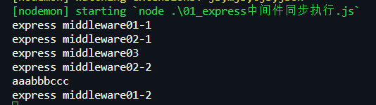
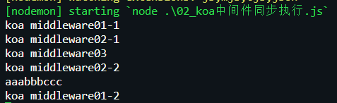
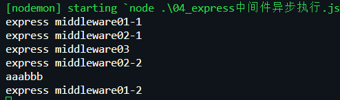
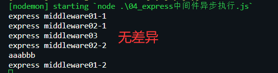
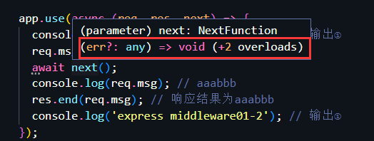
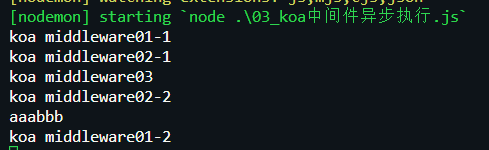
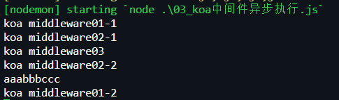
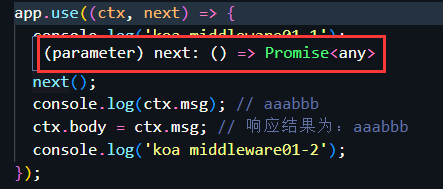
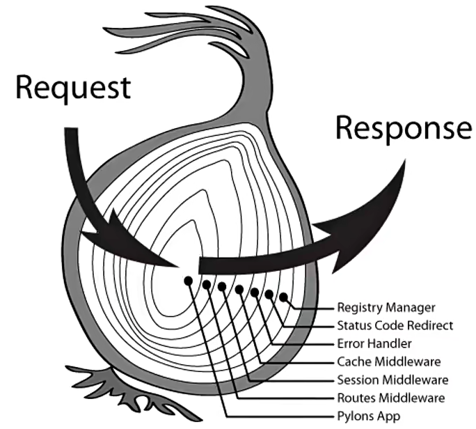

# 架构设计

> **从架构设计层面而言**

- `express` 是完整和强大的，它内置了很多中间件和路由，帮助开发者实现很多功能
- `koa` 是比较简洁的，它只包含最核心的功能，其他中间件或路由都需要自行安装，并且如今前端大部分框架都趋向于 `koa` 这种架构思想

# 中间件执行机制

> **两者核心都是中间件，但执行机制是存在差异的**

- 在针对某个中间件带有异步操作时，`express` 和 `koa` 的表现是不一致的
- 测试 `express` 和 `koa` 中间件的执行顺序问题

## 同步执行

> **`express` 的中间件同步执行顺序如下(使用三个中间件测试)**

- ①首先匹配第一个中间件，执行内部代码，调用 `next()` 后会将控制权交给第二个中间件，`next()` 之后的代码不会继续执行
- ②在第二个中间件执行 `next()` 之后，又进一步将控制权交给第三个中间件
- ③当第三个中间件的代码执行完，会把控制权返还给第二个中间件，继续执行其内部 `next()` 后的代码，最后将执行权返还到第一个中间件，继续执行剩余代码

```javascript
// 中间件1
app.use((req, res, next) => {
  console.log('express middleware01-1'); // 输出①
  req.msg = 'aaa';
  next();
  console.log(req.msg); // aaabbbccc
  res.end(req.msg); // 响应结果为aaabbbccc
  console.log('express middleware01-2'); // 输出⑤
});

// 中间件2
app.use((req, res, next) => {
  console.log('express middleware02-1'); // 输出②
  req.msg += 'bbb';
  next();
  console.log('express middleware02-2'); // 输出④
});

// 中间件3
app.use((req, res, next) => {
  console.log('express middleware03'); // 输出③
  req.msg += 'ccc';
});
```



> **`koa` 的中间件同步执行顺序和 `express` 无差别(使用三个中间件测试)**



> **总结：在中间件同步执行方面，`koa` 和 `express` 表现并无差异**

## 异步执行

> **`express` 中间件异步执行顺序如下(使用三个中间件测试)**

- **执行顺序和同步的结果一致**，但响应结果不一致，可见 `express` 默认不会等待异步操作的结果完成，而是会直接执行下一步操作

```javascript
// 中间件1
app.use((req, res, next) => {
  console.log('express middleware01-1'); // 输出①
  req.msg = 'aaa';
  next();
  console.log(req.msg) // aaabbb
  res.end(req.msg); // 响应结果为aaabbb
  console.log('express middleware01-2'); // 输出⑤
});

// 中间件2
app.use((req, res, next) => {
  console.log('express middleware02-1'); // 输出②
  req.msg += 'bbb';
  next();
  console.log('express middleware02-2'); // 输出④
});

// 中间件3
app.use((req, res, next) => {
  console.log('express middleware03'); // 输出③
  // 异步操作
  new Promise((resolve) => {
    setTimeout(() => {
      req.msg += 'ccc';
      resolve();
    }, 0);
  });
});
```



- 使用 `async/await` 后的结果



- 可见 `express` 中不会在意是否使用 `async/await`，默认都是不等待异步操作结果，这是因为 `express` 的 `next()` 的返回值类型是 `void`，`await` 对其无效



> **`koa` 的中间件异步执行顺序(使用三个中间件测试)**

- 执行结果和 `express` 无差别，都是默认不会等待异步操作结果，而是直接执行下一步操作

```javascript
app.use((ctx, next) => {
  console.log('koa middleware01-1');
  ctx.msg = 'aaa';
  next();
  console.log(ctx.msg); // aaabbb
  ctx.body = ctx.msg; // 响应结果为：aaabbb
  console.log('koa middleware01-2');
});

app.use((ctx, next) => {
  console.log('koa middleware02-1');
  ctx.msg += 'bbb';
  next();
  console.log('koa middleware02-2');
});

app.use((ctx, next) => {
  console.log('koa middleware03');
  new Promise((resolve) => {
    setTimeout(() => {
      ctx.msg += 'ccc';
      resolve();
    }, 0);
  });
});
```



- 使用 `async/await` 后的结果



- 可见 `koa` 在使用 `async/await` 后，会等待异步操作结果完成后，才会执行下一步操作，因为 `koa` 的 `next()` 返回的是 `Promise`，`await` 会对它产生影响



> **总结：在中间件异步执行方面，`express` 和 `koa` 在使用 `async/await` 后表现不一致**

- 在中间件内带有异步操作时，`express` 不会等待异步操作结果完成，而 `koa` 在使用 `async/await` 的情况下，会等待异步操作的结果
- `express` 的 `next()` 函数返回的类型是 `void`，`koa` 的 `next()` 函数返回类型为 `Promise`，这也是`express` 只能在最后的中间件处理响应数据的原因，同时也是 `express` 当初设计的一种缺陷

# koa洋葱模型



- `koa` 的中间件模型就是洋葱模型，`koa` 的每个中间件就像一个洋葱圈，当接收到客户端的请求时，`koa` 的中间件都会执行两次
- `koa` 的中间件模型就是以 `next()` 函数为分割点，先由外到内处理 `request` 逻辑，然后从内到外处理 `response` 逻辑
- 在同步的情况下，`express` 的中间件也是洋葱模型，但异步时 `express` 就无法由内向外处理 `response`