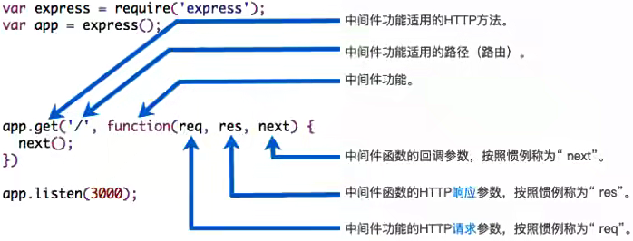
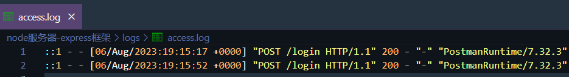
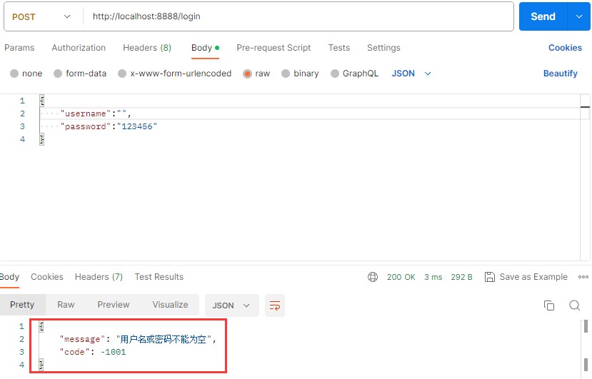

# Express简介

- `Express` 是一款在 `Node` 中比较流行的 Web 服务器框架
- 可以基于 `Express` 快速、方便地开发自己的 Web 服务器，并且可以通过工具和中间件来扩展功能
- `Express` 框架的核心就是中间件

# 基本使用

> **可以通过两种方式使用 `express`**

1. 通过 `express` 脚手架，直接创建应用的骨架

```shell
# 安装脚手架
npm install -g express-generator

# 创建项目
express express-demo

# 安装依赖
npm install

# 启动项目
node bin/www
```

2. 从零搭建自己的 `express` 应用结构

```shell
# 初始化
npm init -y

# 安装express框架
npm install express
```

> **使用 `express` 启动一个服务器**

```javascript
const express = require('express');

// 创建express服务器
const app = express();

// 客户端访问的URL：/login(post请求)和/home(get请求)
app.post('/login', (req, res) => {
  res.end('登录成功~');
});
app.get('/home', (req, res) => {
  res.end('Hello World');
});

// 启动服务器，监听8888端口
app.listen(8888, () => {
  console.log('express服务器启动成功');
});
```

# 中间件简介

- `Express` 是一个路由和中间件的Web框架，其本身的功能非常少
- `Express` 应用程序**本质上是一系列中间件函数的调用**

> **中间件：**本质是传给 `express` 的一个回调函数，该回调函数接受三个参数

- 请求对象(request对象)
- 响应对象(response对象)
- next函数(用于执行下一个中间件的函数)

```javascript
// app.post('/login', 回调函数 => 中间件)
app.post('/login', (req, res, next) => {})
```

> **中间件可执行的任务**

- 执行任何代码
- 更改请求(request)和响应(response)对象

```javascript
app.post('/login', (req, res, next) => {
  req.name = 'Jimmy';
});
```

- 结束 **请求 -> 响应** 周期

```javascript
app.post('/login', (req, res, next) => {
  res.end('登录成功');
});
```

- 调用栈中的下一个中间件

```javascript
app.post('/login', (req, res, next) => {
  console.log('第一个中间件')
  next(); // 调用下一个中间件
});

// 使用最基本的中间件
app.use(() => {
  console.log('第二个中间件')
})
```

> **注意：**如果当前中间件没有结束**请求 -> 响应**周期，则必须调用 `next()` 将控制权传递给下个中间件功能，否则请求将被挂起



# 应用级别中间件

- 当 `express` 接收到客户端发送的网络请求时，在所有中间中开始进行匹配
- 当匹配到第一个符合要求的中问件时，那么就会执行这个中间件
- 后续的中间件是否执行取决于上一个中间件是否调用 `next()`

> **`express` 提供了两种方式将中间件注册到应用程序中**，这种注册到 `app` 上的中间件称为应用级别中间件

- **app.use()：**通过该方法注册的中间件，任何请求方式都可以匹配

- **app.methods()：**其中 `methods` 指的是请求方式，如 `get`，`post` 等

## app.use

- 最普通的中间件

```javascript
app.use((req, res, next) => {
  console.log('first normal middleware');
  next() // 调用下一个中间件
});

app.use((req, res, next) => {
  console.log('second normal middleware');
});
```

- `path` 匹配的中间件(仅对路径作限制)

```javascript
app.use('/home', (req, res, next) => { // 仅匹配/home路径
  console.log('match home middleware');
  res.end('Home Page');
});
```

## app.methods

- `path` 和 `method` 都匹配的中间件

```javascript
// 仅匹配/home路径并且是get请求
app.get('/home', (req, res, next) => {
  console.log('match home get middleware');
  res.end('Home Data');
});

// 仅匹配/users路径并且是post请求
app.post('/users', (req, res, next) => {
  console.log('match users post middleware');
  res.end('Users Data');
});
```

- 一次性注册多个中间件

```javascript
app.get(
  '/home',
  (req, res, next) => {
    console.log('01 match home get middleware');
    next();
  },
  (req, res, next) => {
    console.log('02 match users post middleware');
    next();
  },
  (req, res) => {
    console.log('03 match users post middleware');
    res.end('Home Data');
  }
);
```

# 内置中间件

- `express` 框架提供了一些现成的中间件，可以用于对 `request` 对象进行解析
- `registry` 仓库中也有很多可以辅助开发使用的中间件

## json()

- 使用 `express.json()` 中间件，对客户端传递的 `JSON` 格式数据作解析，并添加到 `req.body` 中

```javascript
const express = require('express');
const app = express();

app.use(express.json());

app.post('/login', (req, res) => {
  const { username, password } = req.body;
  console.log(username, password); // 'Jimmy' '123456'
});
```

> **`express.json()` 中间件的原理**

```javascript
app.use((req, res, next) => {
  if (req.headers['content-type'] === 'application/json') {
    req.on('data', (data) => {
      req.body = JSON.parse(data.toString());
    });

    req.on('end', () => {
      next();
    });
  } else {
    next();
  }
});
```

## urlencoded()

- 使用`express.urlencode()` 解析客户端携带的 `urlencoded` 格式的数据，并添加到 `req.body` 中

```javascript
const express = require('express');

const app = express();

app.use(express.urlencoded({ extended: true }));

app.post('/login', (req, res, next) => {
  console.log(req.body); // { username: 'James', password: '123456' }
});

```

> **`extended: true` 的作用：**

- 由于 `urlencode` 默认使用 `node` 内置的 `querystring` 模块解析，但 `querystring` 模块已不推荐使用
- 声明 `extended` 为 `true`时，内部会使用第三方库 `qs`

# 第三方中间件

- `express` 框架除了内置一些中间件外，还有其官方开发的第三方库

## morgan()

- 使用第三方库 `morgan`，用于将请求日志记录下来

```shell
# 安装morgan
npm i morgan
```

- 导入第三方库，应用该中间件写入请求日志

```javascript
const express = require('express');
const morgan = require('morgan');
const fs = require('fs');

const app = express();

const writeStream = fs.createWriteStream('./logs/access.log');
// 应用第三方中间件
app.use(morgan('combined', { stream: writeStream }));

app.post('/login', (req, res, next) => {
  res.end('登录成功~');
});
```



## multer()

- 使用第三方中间件 `multer` 可以实现单文件上传

```shell
# 安装multer
npm i multer
```

- 导入 `multer` 并使用

```javascript
const express = require('express');
const multer = require('multer');

const app = express();

// 调用multer，返回一个对象
const upload = multer({
  dest: './upload' // 上传文件的放置目录
});
```

- 使用 `upload` 对象的 `single` 中间件，对上传的文件进行解析，并添加到 `req.file` 中

```javascript
app.post('/upload', upload.single('avatar'), (req, res, next) => {
  // 获取上传文件的信息
  console.log(req.file);
  res.end('文件上传成功~');
});
```

> **注意：使用 `dest` 声明保存文件的目录，会导致文件没有后缀名，进而使得文件出现异常**

- **解决：**使用 `multer.diskStorage()` 方法，确定文件的存放路径，并自定义文件名称

```javascript
const upload = multer({
  storage: multer.diskStorage({
    // 文件保存路径
    destination(req, file, cb) {
      cb(null, './uploads'); // 需保证目标文件夹存在
    },
    // 文件自定义名称
    filename(req, file, cb) {
      cb(null, Date.now() + '_' + file.originalname);
    }
  })
});
```

> **如何接收客户端上传多个文件？**

- 使用 `upload` 对象的 `array` 中间件，对上传的多个文件解析，并添加到 `req.files` 中

```javascript
app.post('/photos', upload.array('photos'), (req, res, next) => {
  // 获取上传文件的信息
  console.log(req.files);
  res.end('文件上传成功~');
});
```

# 其他参数类型解析

- `body` 携带的参数和 `form-data` 携带的文件都有对应的中间件解析，但获取 `query` 和 `params` 参数不需要使用中间件
- `express` 框架内部已经将 `query` 和 `params` 参数，存放于 `request` 对象中

```javascript
app.get('/home/list', (req, res, next) => {
  // 获取query参数
  console.log(req.query); // { offset: '1', size: '10' }
  res.end('home list数据');
});

app.get('/users/:id', (req, res, next) => {
  // 获取pramas参数
  console.log(req.params); // { id: '123' }
  res.end('user数据');
});
```

# 响应数据

- 响应数据通过 `response` 对象，向客户端返回需要的数据
- 通过 `res.end()` 返回字符串，该方法类似于 `http` 模块中的 `response.end` 方法

```javascript
app.post('/login', (req, res, next) => {
  // res.end('登录成功~');
});
```

- 通过 `res.json` 方法，可以向客户端返回多种类型，如 `object`、`array`、`string`、`boolean`、`number`、`null` 等，都会被转换成 `json` 格式返回

```javascript
app.post('/login', (req, res, next) => {
  res.json({ message: '登录成功', code: 200 });
});
```

- 通过 `res.status` 方法设置 `http` 的状态码

```javascript
app.post('/login', (req, res, next) => {
  res.status(201);
  res.end('登录成功~');
});

// 也可以链式调用
res.status(201).end('登录成功~');
res.status(201).send('登录成功~');
```

- **更多响应方式：**https://www.expressjs.com.cn/4x/api.html#res

# 路由系统

- 如果将所有代码逻辑都写在 `app` 中，那么 `app` 会变得越来越复杂，项目难以维护
- 完整的 Web 服务器包含非常多的处理逻辑，有些处理逻辑其实是一个整体，应该将它们放在一起

> **使用 `express.Router` 创建一个路由处理程序**

- 一个 `Router` 实例拥有完整的中间件和路由系统，**在路由上注册的中间件称为路由级别中间件**
- 因此 `Router` 实例也被**称为迷你应用程序(mini-app)**

```javascript
// 使用路由
const userRouter = express.Router();

// 将用户相关的路由注册到router中
userRouter.get('/', (req, res, next) => {
  res.end('用户列表');
});
userRouter.get('/:id', (req, res, next) => {
  res.end('用户数据');
});
userRouter.post('/add', (req, res, next) => {
  res.end('添加用户');
});
userRouter.delete('/del', (req, res, next) => {
  res.end('删除用户');
});
userRouter.patch('/update', (req, res, next) => {
  res.end('更新用户');
});

// 注册路由
app.use('/users', userRouter);
```

# 静态资源部署

- `Node` 也可以作为静态资源服务器，并且 `express` 提供了方便部署静态资源的方法
- 使用 `express` 内置的 `static` 中间件，可以将图片、前端项目等部署

```javascript
const express = require('express');

const app = express();

// 将uploads下的静态资源部署
app.use(express.static('./uploads'));

app.listen(8888, () => {
  console.log('express服务器启动成功');
});

```

- 然后可以通过浏览器访问部署好的资源


# 错误处理

- 如果客户端携带的数据不符合要求，服务端需要进行错误处理，然后将对应的错误信息响应到客户端

> **服务端处理错误信息有两种方案：**

- 直接通过 `res.status()` 修改 http 状态码，然后返回对应的错误信息

```javascript
res.status(401).end('登录过期')
```

- 不修改 http 状态码，而是自定义一套状态码，告知客户端某个状态码对应的错误

```javascript
app.use(express.json());


app.post('/login', (req, res, next) => {
  const { username, password } = req.body;
  // 对登录信息拦截，进行错误处理
  if (!username || !password) {
    next(-1001); // 通过next()调用错误处理的中间件，并且传递参数
  } else if (username !== 'Jimmy' || password !== '123456') {
    next(-1002);
  } else {
    res.json({ message: '登录成功~', code: 0, token: 'sadafagwq' });
  }
});

// 错误处理的中间件，这里包含四个参数
// 其中第一个参数是上一个中间件调用next()后传递的
app.use((errCode, req, res, next) => {
  const message = new Map([
    [-1001, '用户名或密码不能为空'],
    [-1002, '用户名或密码错误'],
    [0, '登录成功~']
  ]).get(errCode);

  res.json({ message, code: errCode });
});
```


