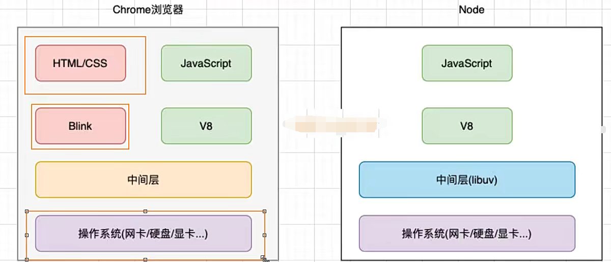
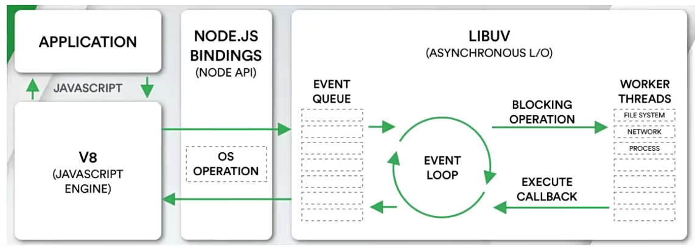

# Node简介

- `Node.js` 是一个基于 `V8 JavaScript` 引擎的 **`JavaScript` 运行时环境**，即基于 `V8` 引擎执行`JavaScript` 代码
- `Node.js` 中还有一些额外的操作，如**文件系统读/写**、**网络IO**、**加密**、**压缩解压文件**等

> **浏览器和 `Node.js` 架构区别**



# Node架构

> **`Node.js` 架构图**



- 假如现在需要读取一个文件

```javascript
const fs = require('fs');
fs.readFile('./abc.txt', (err, data) => {
  
});
```

- 由于操作系统是无法直接调用 `JavaScript` 代码的，所以首先要通过 `V8` 引擎运行，而 `V8` 引擎使用 `C/C++` 编写
- 因此需要经过 `C/C++` 对 `JavaScript` 代码转化后，变成操作系统可识别的代码
- 然后通过 `Node.js` 的 `Bindings` 调用，将任务放到 `Libuv` 的事件循环中 ，由系统内核发起文件操作
- 读取文件内容后，再次经过操作系统的事件循环，通知 `V8` 引擎执行对应的回调

> **`libuv` 是什么？**

- 使用C语言编写的库，提供了事件循环、文件系统读写、网络IO、线程池等内容
- `Node` 使用异步 I/O 和事件驱动的设计理念，可高效处理大量并发请求，提供非阻塞式 I/O 接口和事件循环机制，进而可以编写出高性能、可扩展的应用程序，而异步 I/O 最终都是由 `libuv` 事件循环库实现

# Node应用场景

- `Node` 适合干一些 I/O 密集型应用，不适合 CPU 应用，其 I/O 依靠 `libuv` 很强的处理能力

> **不适合 CPU 应用的原因**

- 由于 `JavaScript` 是单线程的，所有容易造成 CPU 占用率高
- 想要开发 **CPU 密集型应用**(图像、音频处理等)，可以使用 `Node` 提供的 `cluster`，或是 C++ 插件

> **依靠 `Node` 运行，或运行环境可以配合 `Node` 的场景：**

- **前端：** `Vue`、`Angular`、`React`、`nuxtjs`、`nextjs` 等

- **后端：**`express`、`koa`、`Nestjs`、`socket.io`、爬虫等
- **桌面端：**`electron`
- **移动端：**`weex`，`React Native`
- **CICD：**`docker`、 `Jenkins`