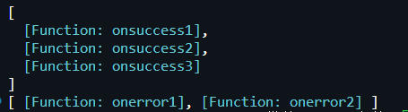
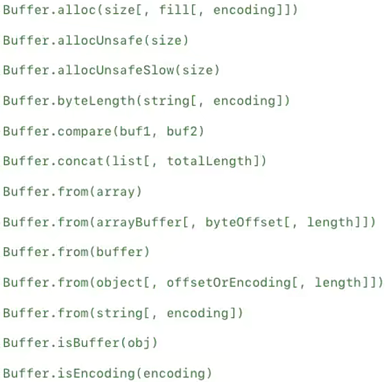

# fs文件系统模块

- 借助于 `Node` 封装的文件系统，可以在任何操作系统上直接操作文件，这是 `Node` 可以开发服务器的0原因之一，也是成为前端自动化脚本的原因

- **`API` 文档：**https://nodejs.org/docs/latest-v16.x/api/fs.html

## 读取文件

> **`API` 大多数提供三种读取方式**

- **同步读取文件：**代码会被阻塞

```javascript
const fs = require('fs');
// 返回读取的文件内容，如果不指定encoding，默认返回Buffer
const syncResult = fs.readFileSync('./abc.txt', { encoding: 'utf-8' });
```

- **异步回调读取文件：**代码不被阻塞，需传入回调函数，待获取结果后执行回调

```javascript
const fs = require('fs');

fs.readFile('./abc.txt', { encoding: 'utf-8' }, (err, data) => {
  if (err) return console.log('读取文件错误', err);
  console.log('读取结果：', data);
});
```

- **异步Promise读取文件：**代码不被阻塞，返回一个Promise

```javascript
const fs = require('fs');

fs.promises.readFile('./abc.txt', { encoding: 'utf-8' }).then((data) => {
		console.log('读取结果：', data);
	}).catch((err) => {
    console.log('读取文件错误', err);
	});
```

## 文件描述符

- 每个进程的内核维护着一张当前打开的文件和资源的表格，**每个打开的文件都分配了一个称为文件描述符的简单数字标识符**
- 在系统层，**所有文件系统操作都使用文件描述符来标识和跟踪每个特定文件**
- `Node.js` 抽象出操作系统之间的特定差异，并**为所有打开的文件分配一个数字型的文件描述符**

```javascript
const fs = require('fs');

// 打开一个文件
fs.open('./bbb.txt', (err, fd) => {
  if (err) return;
  // 获取文件描述符
  console.log('文件描述符：', fd);
  // 通过文件描述符读取文件信息
  fs.fstat(fd, (err, stats) => {
    if (err) return;
    console.log('文件信息：', stats);
    // 手动关闭文件
    fs.close(fd, (err) => {
      if (err) return;
      console.log('文件关闭成功');
    });
  });
});
```

- `fs.open()` 用于分配新的文件描述符，利用文件描述符可读取文件信息或数据，或向文件写入数据

## 文件写入

- 可以使用 `fs.writeFile(file, data [,options], callback)` 向文件中写入内容

```javascript
const content = 'Hello NodeJs, My name is Jimmy';
// 文件写入操作，若目标文件不存在则创建
fs.writeFile('./ccc.txt', content, { encoding: 'utf-8', flag: 'a' }, (err) => {
  if (err) return console.log('文件写入失败', err);
  console.log('文件写入成功');
});
```

> **`options` 参数：**

- **flag：**写入的方式(https://nodejs.org/dist/latest-v14.x/docs/api/fs.html#fs_file_system_flags)
  - **w：**打开文件写入(覆盖)，默认值
  - **w+：**打开文件进行读写(可读可写)，如果不存在则创建文件
  - **r：**打开文件读取，读取时的默认值
  - **r+：**打开文件进行读写，如果不存在那么抛出异常
  - **a：**打开要写入的文件，将流放在文件末尾，如果不存在则创建文件
  - **a+：**打开文件以进行读写(可读可写)，将流放在文件末尾，如果不存在则创建文件
- **encoding：**字符编码

## 文件夹操作

- 使用 `fs.mkdir()` 或 `fs.mkdirSync()` 创建一个新文件夹

```javascript
const fs = require('fs');

// 创建文件夹
fs.mkdir('./test', (err) => {
  if (err) return console.log('文件夹创建失败', err);
  console.log('文件夹创建成功');
});
```

- 使用 `fs.readdir()` 读取文件夹，并获取文件夹下所有文件的信息

```javascript
// 读取文件夹，同时获取文件夹中文件的信息
fs.readdir('./test', { withFileTypes: true }, (err, files) => {
  if (err) return console.log('文件夹读取失败', err);
  // 获取文件夹中的所有文件,以字符串数组形式返回
  files.forEach((file) => {
    console.log(`${file.name}${file.isDirectory() ? '是文件夹' : '是文件'}`);
  });
});
```

- 递归读取文件夹下所有文件

```javascript
// 递归读取文件夹中所有文件
const readDirectory = (path) => {
  fs.readdir(path, { withFileTypes: true }, (err, files) => {
    if (err) return console.log('文件夹读取失败', err);
    files.forEach((file) => {
      if (file.isDirectory()) {
        readDirectory(`${path}/${file.name}`);
      } else {
        console.log(`读取到文件：${file.name}`);
      }
    });
  });
};
readDirectory('./test');
```

- 使用 `fs.rename()` 对文件/文件夹进行重命名

```javascript
fs.rename('./test', './newTest', (err) => {
  if (err) return console.log('文件夹重命名失败', err);
  console.log('文件夹重命名成功');
});
```

# events模块

- `Node` 的核心 `API` 都是基于异步事件驱动的
- 在此体系中某些对象(发射器Emitters)发出一个事件，可以监听该事件(监听器Listeners)，并传入回调函数，该回调函数会在监听到事件时执行

## 基本使用

> 事件的发出和监听都是通过 `EventEmitter` 类，属于 `events` 对象

```javascript
const EventEmitter = require('events');
// 创建EventEmitter实例
const emitter = new EventEmitter();
```

- **`emitter.on(eventName, listener)`：**监听事件，也可使用 `addListener`

```javascript
const onSuccess = (data) => {
  console.log('监听到success事件');
  console.log('接收到的数据', data);
};

// 监听事件
emitter.on('success', onSuccess);
```

- **`emitter.emit(eventName[, ...args])`：**发出事件，可携带一些参数

```javascript
// 发射事件
setTimeout(() => {
  emitter.emit('success', 200);
}, 2000);
// 由于node程序会等待所有代码执行完毕才结束
// 这里使用settimeout一开始会延迟2秒
```

- **`emitter.off(eventName, listener)`：**移除事件监听，也可使用 `removeListener`

```javascript
emitter.off('success', onSuccess);
```

## 其他方法

> **`EventEmitter` 实例其他属性**

```javascript
const EventEmitter = require('events');
const emitter = new EventEmitter();

emitter.on('success', function onsuccess1() {});
emitter.on('success', function onsuccess2() {});
emitter.on('success', function onsuccess3() {});

emitter.on('error', function onerror1() {});
emitter.on('error', function onerror2() {});
```

- **`emitter.eventNames()`：**当前 `EventEmitter` 对象注册的事件字符串数组

```javascript
emitter.eventNames(); // [ 'success', 'error' ]
```

- **`emitter.getMaxListeners()`：**当前 `EventEmitter` 对象的最大监听器数量，可以通过`setMaxListeners()` 来修改，默认是10

```javascript
emitter.setMaxListeners(15);
console.log(emitter.getMaxListeners()); // 15
```

- **`emitter.listenerCount(eventName)`：**当前 `EventEmitter` 对象某个事件名称监听器个数

```javascript
emitter.listenerCount('success'); // 3
emitter.listenerCount('error'); // 2
```

- **`emitter.listeners(eventName)`：**当前 `EventEmitter` 对象某个事件名称上所有的监听器数组

```javascript
emitter.listeners('success')
emitter.listeners('error')
```



- **`emitter.once(eventName, listener)`：**事件只监听一次

```javascript
// 该事件只监听一次
emitter.once('loaded', () => {})
```

- **`emitter.prependListener()`：**将监听事件添加到最前面

```javascript
emitter.on('loaded', () => {
  console.log('loaded');
});

emitter.prependListener('loaded', () => {
  console.log('loaded-prepend');
});

emitter.emit('loaded'); // 'loaded-prepend' 'loaded'
```

- **`emitter.prependOnceListener()`：**将监听事件添加到最前面，但只监听一次

```javascript
emitter.prependOnceListener('loaded', () => {})
```

- **`emitter.removeAllListeners([eventName])`：**移除所有的监听器

```javascript
emitter.removeAllListeners(['success', 'error'])
```

# buffer存储模块

- 对于服务器端来说，为了做更多的功能，有时候必须直接去操作其二进制的数据
- `Node` 提供了全局的 `Buffer` 类，方便开发者完成更多功能
- `Buffer` 可以看成存储二进制的数组，每一项保存**8位二进制(一个字节)**

## 与字符串的转换

- `Buffer` 相当于是一个字节的数组，数组中的每一项对应一个字节的大小

> **将一个字符串放入到 `Buffer` 的过程**

```javascript
const buffer = Buffer.from('Hello');

console.log(buffer); // <Buffer 48 65 6c 6c 6f>
```

- ①先将字符串通过 `ascii` 编码，转换成对应的16进制，如 `H -> 48`
- ②然后将16进制存储到 `Buffer` 中，每个16进制可以转换成8位的二进制，相当于一个字节

> **存储中文字符串**

- 每个中文需要3个字节存储，默认编码为 `uft-8`

```javascript
const buffer = Buffer.from('你好');

console.log(buffer); // <Buffer e4 bd a0 e5 a5 bd>
```

> **如果编码和解码格式不一致**

```javascript
const buffer3 = Buffer.from('你好', 'utf16le');

console.log(buffer3.toString('utf-8')); // 出现乱码
```

## 其他创建方式



- `Buffer.alloc()` 创建buffer，用于向操作系统申请内存空间

```javascript
// 向操作系统申请8个字节大小的内存空间
const buffer = Buffer.alloc(8);
console.log(buffer); // <Buffer 00 00 00 00 00 00 00 00>

// 手动对每个字节进行操作
buffer[0] = 100;
buffer[1] = 0x66;
console.log(buffer); // <Buffer 64 66 00 00 00 00 00 00>
```

## 文件操作

- 读取文件时不指定编码格式，默认是 `Buffer`，可以对读取的数据进行更改

```javascript
const fs = require('fs');

// 从文件中读取buffer
fs.readFile('./aaa.txt', (err, data) => {
  if (err) return;
  console.log('读取结果：', data.toString()); // 读取结果： 你好啊
  data[0] = 0xe5;
  data[1] = 0x95;
  data[2] = 0x8a;
  console.log('读取结果：', data.toString()); // 读取结果： 啊好啊
});
```

# path路径模块

- path模块是 `Node` 提供用于处理路径，它包含一系列的方法和属性，满足开发者对路径的处理需求

```javascript
const path = require('path');
```

## 路径拼接

- 使用 `path.join()` 进行路径拼接，该方法将参数拼接为一个路径字符串，并返回拼接后的路径 

```javascript
const pathStr = path.join('/a', '/b/c', '../', '/d', 'e');

console.log(pathStr); // \a\b\d\e
// 这里拼接时使用“../”, 会抵消前面的路径
```

- 使用 `__dirname` 获取当前工作路径

```javascript
const pathStr = path.join(__dirname, '/files/aaa.txt');

console.log(pathStr); // E:\FrontEnd-Study\nodejs\node模块-path路径\files\aaa.txt
```

## 路径解析

- 使用 `path.resolve` 方法将参数解析为绝对路径，并返回解析后的路径字符串
- 该方法以当前工作目录为基准，根据传入的路径参数解析出一个绝对路径 

```javascript
const pathStr2 = path.resolve(__dirname, 'files/1.txt');

console.log(pathStr2); // E:\FrontEnd-Study\nodejs\node模块-path路径\files\1.txt
```

## 文件名/扩展名获取

- 使用 `path.basename()` 方法获取路径中的最后一部分，通过该方法获取路径中的文件名

```javascript
// 获取文件全名
const fullName = path.basename('/aa/bb/cc/index.js');
// 去除扩展名
const fileName = path.basename('/aa/bb/cc/index.js', '.js');

console.log(fullName); // index.js
console.log(fileName); // index
```

- 使用 `path.extname()` 方法获取路径中的扩展名

```javascript
const extName = path.extname('/aa/bb/cc/index.js');

console.log(extName); // .js
```