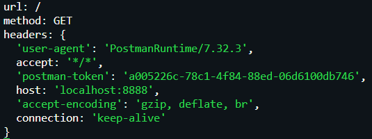
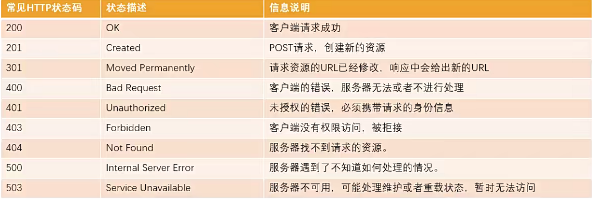

# Stream读写操作

> **`stream` 是什么？**

- 从一个文件中读取数据时，文件的二进制数据会源源不断被读取到程序中，而这种一连串的字节，就是**程序中的流(stream)**
- 流是**连续字节的一种表现形式和抽象概念**，同时是**可读可写**的

> **既然可以通过 `readFile` 或 `writeFile` 读写文件，为何需要流？**

- **无法控制细节：**如开始读的位置、结束位置、一次性读取多少字节等
- **读取不可控：**如当读到某个位置时需要暂停读取，在某个时刻又恢复继续读取
- **文件过大：**如视频文件一次性全部读取并不合适

> **所有的流都是 `EventEmitter` 的实例，`Node` 中的四种基本流类型：**

- **Writable：**可以向其写入数据的流，如 `fs.createWriteStream()`
- **Readable：**可以从中读取数据的流，如 `fs.createReadStream()`
- **Duplex：**同时为 `Readable` 和 `Writable`，如 `net.Socket`
- **Transform：**`Duplex` 可在写入和读取数据时修改或转换数据的流，如 `zlib.createDeflate()`

## Readable可读流

- 通过 `fs.createReadStream()` 开启可读流

```javascript
const readStream = fs.createReadStream('./aaa.txt', {
  start: 3, // 流的起始位置
  end: 15, // 流的结束位置
  highWaterMark: 4 // 每次读取的字节数，默认是64kb
});
```

- 由于流是 `EventEmitter` 实例，可以监听 `data` 事件，流读取完成后会触发

```javascript
// 监听流读取完成的事件
readStream.on('data', (chunk) => {
  console.log('接收到的数据', chunk.toString());
});
```

- 流的暂停

```javascript
readStream.pause();
```

- 流的继续读取

```javascript
readStream.resume();
```

- 流的其他事件

```javascript
// 通过流打开文件后触发的事件
readStream.on('open', (fd) => {
  console.log('文件打开成功', fd);
});

// 数据读取完毕触发的事件
readStream.on('end', () => {
  console.log('数据读取完毕');
});

// 通过流关闭文件后触发的事件
readStream.on('close', () => {
  console.log('文件关闭成功');
});
```

## Writable可写流

- 通过 `fs.createWriteStream()` 开启可写流

```javascript
const fs = require('fs');

const writableStream = fs.createWriteStream('./bbb.txt', {
  flags: 'a+'
});
```

- 通过其 `write` 方法，向文件中写入内容

```javascript
writableStream.write('Hello Jimmy', (err) => {
  if (err) return console.log('写入失败', err);
  console.log('写入成功');
});
```

- 内容写入完成后，由于写入流不会自动关闭，则需要手动调用其 `close` 方法关闭文件

```javascript
writableStream.close();
```

- 也可以通过其 `end` 方法，将最后的内容写入文件中，并关闭文件

```javascript
writableStream.end('finish content');
```

- 监听流的事件

```javascript
// 监听文件被关闭事件
writableStream.on('close', () => {
  console.log('文件关闭成功');
});

// 监听文件被打开事件
writableStream.on('open', (fd) => {
  console.log('文件描述符：', fd);
});

// 监听内容写入完成事件
writableStream.on('finish', () => {
  console.log('内容写入完成');
});
```

## pipe方法

- 通过 `pipe` 方法，将可读流的内容之间放入到可写流

```javascript
const fs = require('fs');

// 创建可读流
const readStream = fs.createReadStream('./ccc.txt');
// 创建可写流
const writeStream = fs.createWriteStream('./ccc_copy.txt');
// 在两个流之间建立一个管道,将可写流的数据放入到可写流
readStream.pipe(writeStream);
```

# http模块

- 在 `Node` 中，提供 `web` 服务器的资源返回给浏览器，主要是通过 `http` 模块
- 利用 `http.createServer()` 方法，创建服务器对象，其底层是直接 `new Server` 对象

> **创建Server时传入的回调携带两个参数**
>
> - **req：**请求对象，包含客户端请求相关的信息
> - **res：**响应对象，包含发送给客户端的信息

```javascript
const http = require('http');

// 创建http服务器
const server = http.createServer((req, res) => {
  // request对象用于获取客户端的请求信息
  console.log(req);
  // response对象用于给客户端响应结果
  res.end('Hello World');
});
```

- 通过 `server.listen()` 方法开启服务器，并监听端口号

```javascript
// 开启服务器，监听8888端口
server.listen(8888, () => {
  console.log('服务器启动成功');
});
```


## request对象

- request对象**本质上是一个可读流**，可以使用可读流的所有方法

> **向服务器发送请求时携带的信息：**

- **请求的 `URL`：**服务器需要根据不同的URL进行不同的处理
- **请求的方式：**如GET、POST请求传入的参数和处理的方式是不同的
- **请求的 `headers`：**如客户端信息、接受数据的格式、支持的编码格式等

```javascript
const server = http.createServer((req, res) => {
  // req对象中包含的信息
  console.log('url:', req.url); // url
  console.log('method:', req.method); // method
  console.log('headers:', req.headers); // headers
  res.end('Hello World');
});
```



### url和method处理

- 服务器需要根据不同的请求地址，做出不同响应

```javascript
const server = http.createServer((req, res) => {
  res.end(distinguishUrl(req.url));
});

const distinguishUrl = (url) => {
  return new Map([
    ['/login', '登录成功~'],
    ['/products', '商品列表~'],
    ['/lyric', '歌词数据~']
  ]).get(url);
};
```

- 服务器还需要判断支不支持当前的请求方式

```javascript
const server = http.createServer((req, res) => {
  const { method, url } = req;
  if (url === '/login') {
    method === 'POST' ? res.end('登录成功~') : res.end('不支持该请求方法~');
    return;
  }
  res.end('Hello World');
});
```

### query参数

- 当客户端通过 `url` 拼接参数传递到服务端时，需要使用 `node` 的 `url` 模块做解析

```javascript
const url = require('url');

const server = http.createServer((req, res) => {
  // url: /home/list?offest=100&size=20
  // 获取客户端附带url传递的参数
  const urlInfo = url.parse(req.url);
  
  res.end('Hello World');
});
```

- 然后通过 `querystring` 模块对参数部分做转换

```javascript
const qs = require('querystring');

// 解析urlInfo的query：offest=100&size=20
const queryInfo = qs.parse(urlInfo.query);
console.log(queryInfo); // { offest: '100', size: '20' }

// 获取url路径名称
console.log(urlInfo.pathname); // /home/list
```

### body参数

- 由于request对象本质是可读流，在客户端通过 `body` 传参时，如果通过 `req.body` 获取是获取不到的.

```javascript
req.body // undefined
```

- 需要监听 `req` 的 `data` 事件，获取 `body` 中的参数

```javascript
const server = http.createServer((req, res) => {
  // 设置字符编码格式，若不设置默认接收的是buffer
  req.setEncoding('utf8'); 

  req.on('data', (data) => {
    // 这里接收的是Json格式，先作解析
    const loginInfo = JSON.parse(data);
    console.log(loginInfo); // { name: 'Jimmy', password: 'admin123' }
  });

  res.end('Hello World');
});
```

### headers信息

- 在request对象的 `header` 中包含很多有用的信息，客户端会默认传递过来一些信息

> **content-type：携带的数据类型**
>
> - **`application/x-www-form-urlencoded`：**数据以 `&` 分隔的键值对，同时以 `=` 分隔键和值
> - **`application/json`：** `json` 类型
> - **`text/plain`：**文本类型
> - **`application/xml`：** `xml` 类型
> - **`multipart/form-data`：**上传文件类型

```javascript
req.headers['content-type']; // 用于告知body里携带的参数类型
```

----

- **content-length：**用于获取客户端携带的参数或文件大小

- **accept-encoding：**客户端支持的文件压缩格式

- **accept：**客户端可接受的文件格式类型
- **user-agent：**客户端相关的信息;

## response对象

- response对象**本质是一个可写流**，可以使用可写流的所有方法

> **响应数据方式**

- 通过 `write` 方法向响应结果写入内容，但并没有关闭流
- 最后需要通过 `end` 方法写出最后数据，并关闭流

```javascript
const server = http.createServer((req, res) => {
  res.write('Hello World');
  res.end('响应结束');
});

// 响应内容：Hello World响应结束
```

### 返回状态码

- `Http` 状态码(HTTP Status Code)用于表示 `Http` 响应状态的数字代码，可以根据不同情况，给客户端返回不同的状态码
- `MDN` 响应码解析地址: https://developer.mozilla.org/zh-CN/docs/web/http/status



- 通过 `statusCode` 设置状态码

```javascript
res.statusCode = 401;
```

- 通过 `writeHead` 方法设置响应头

```javascript
res.writeHead(401);
```

### 设置headers

- 通过 `res.setHeader` 设置响应头，一次写入一个头部信息

```javascript
res.setHeader('Content-Type', 'text/plain;charset=utf8');
```

- 通过 `res.writeHead` 同时写入 `header` 和 `statusCode`

```javascript
res.writeHead(200, {
  'Content-Type': 'text/plain;charset=utf8'
});
```

> **Header设置Content-Type的作用**

- 默认客户端接收到的是字符串，客户端会按照自己默认的方式进行处理
- 设置 `Content-Type` 用于指定响应数据的格式

## 网络请求

- 在 `Node` 中可以使用 `http` 内置模块发送请求，`axios` 也是使用 `http` 模块

- 使用 `http` 模块发送 `get` 请求

```javascript
const http = require('http');

http.get('http://localhost:8888', (res) => {
  // 从可读流中获取数据
  res.on('data', (data) => {
    console.log(data.toString());
  });
});
```

- 使用 `http` 模块发送 `post` 请求

```javascript
const req = http.request(
  {
    method: 'POST',
    port: 8888,
    hostname: 'localhost'
  },
  (res) => {
    // 从可读流中获取数据
    res.on('data', (data) => {
      console.log(data.toString());
    });
  }
);

req.end();
```

## 文件上传

- 首先通过 `http` 模块启动一个服务器，以图片为例，服务端默认接收到的格式为 `buffer` 
- 若需要保存图片，则需设置编码格式为二进制

```javascript
const http = require('http');

const server = http.createServer((req, res) => {
  // 设置格式编码为二进制
  req.setEncoding('binary');
});

// 开启服务器，监听8888端口
server.listen(8888, () => {
  console.log('服务器启动成功');
});
```

> **完整的二进制图片数据如下所示：**

```javascript
// 无用的额外数据：图片前的信息
----------------------------410470761283236295431305
Content-Disposition: form-data; name="avatar"; filename="zhm.png"
Content-Type: image/png

// 有用的图片数据
‰PNG\r\n\n\rIHDR›ÉSޔsRGB®ÎégAMA±üa\tpHYsÃÃÇo¨dÿ¥IDATx^äýe׺í\rçí½%1Û23³˜¡¥–ZÝR3ˆ™™-3³3³ÇaNÖÞçùh×3Æ5«º[à$++gïsîûÅøÍ⮪®ºþsLª÷Úü%Ò(•®Sz¢.é«©”þZ·ÔUÉ`}µ6xd¸±JFšªe´É+cÐh#¦¡‘·Qc%–WÊx«KuxäH·WŽöúäÄ@PN†äôHHΎ†åüxX.LDäÒdTnkGç;åùÕys{P¾|8*ß=›’Ÿ^NË/¯§åŸ¯Ë/¯¦åÇSòí“1ùüþ0¶ë—××»åÉÅv¹{ºI>:V'—Õȹ±9ڐÉ6œ'Îe ¦Bz"…õÍQšÃ3“`à©õTR2‚L¥µßŽÔœ£ÒÃ÷Œb–Š#&ˆX E5ЏºNãÔnZ ‘cuÛØây[œÝÂ8As~|Gû·Í"MuÔ,ÈUiò>7ô¥{}]\\BKSzç°8·ƒkWT%™Ç¼ØaJÝtgÆÍ£ÊÚ¬¯ ¨‘š:tNŽ¯bmùÈô¹Ù¦Š;9z€¶ÖAå×áºÖÒ\\)çýÄû—J´ŒçQH¥Â¤nÔª¹¥©ËlsZ\n¼©Mˆæ¨È;yªí%wGz‹š7^ÂÒü:چ©œü7´šÏ¸U\nG‹:yݨ֞üFy¾ÚӗÂCÖêVí±z$j+ÑÁç#AÁ¦»ÍaPÙ6·\t›#iÚàèX°Q끜©þYÎÔNà1aóæKØ4ãÎ@nô5SÕD±CЬ·x©jܘ‰91´¡=àD"@ûÜð9ìb(eaSN”ó8Jàu"Us°Él¤n$\r¥Õ8PKuSWïA=MÃjvޓ»®zþÿøôâpK¨ìIEND®B`‚\r\n
                                                                                         // 无用的额外数据：图片后面的boundary                             
---------------------------410470761283236295431305--\r\n
```

- 对图片数据进行截取

```javascript
const server = http.createServer((req, res) => {
  // 设置格式编码为二进制
  req.setEncoding('binary');
  // 获取图片后面的boundary
	const boundary = req.headers['content-type'].split('; ')[1].split('=')[1];
  // 图片一次性可能接收不完，需要分开几次接收，定义变量用于保存完整的图片数据
	let formdata = '';
  
  // 接收图片数据，并保存
  req.on('data', (data) => {
    formdata += data;
  });
  
  // 图片接收完毕，formdata是完整的图片数据
  req.on('end', () => {
    const imgType = 'image/png';
    // 获取图片数据的起始位置
    const imgDataStart = formdata.indexOf('image/png') + imgType.length;
    // 截图图片数据，并替换图片数据前的两个空格
    let imgData = formdata.slice(imgDataStart).replace(/^\s\s*/, '');
    // 舍弃图片后面的boundary
    imgData = imgData.slice(0, imgData.indexOf(`--${boundary}--`));
    // 将图片数据保存到文件
    fs.writeFile('./zhm.png', imgData, 'binary', (err) => {
      console.log('文件写入成功');
      res.end('文件上传成功');
    });
  });
});
```


